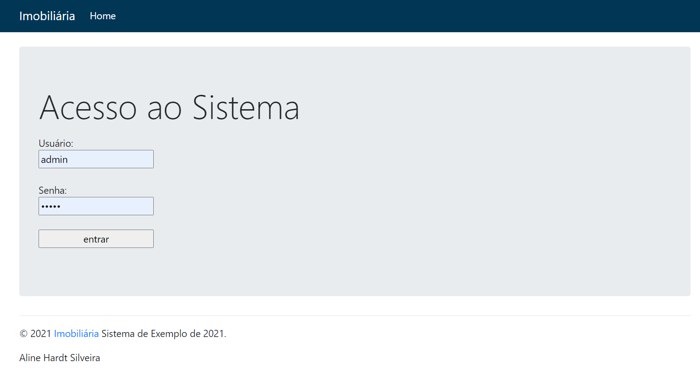
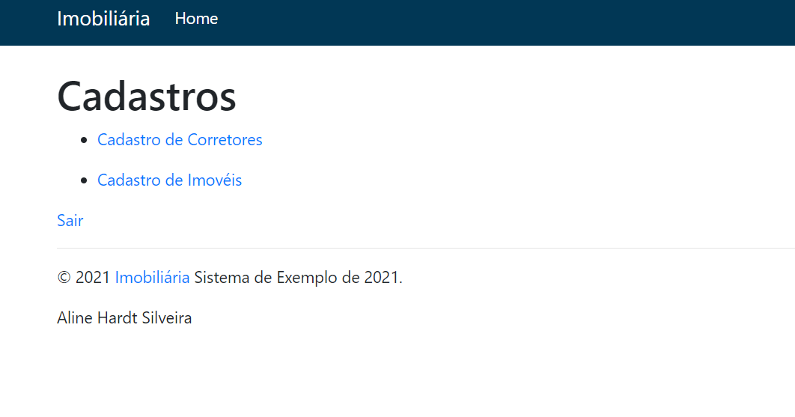
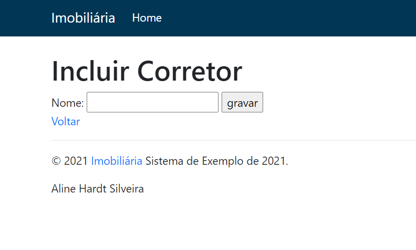
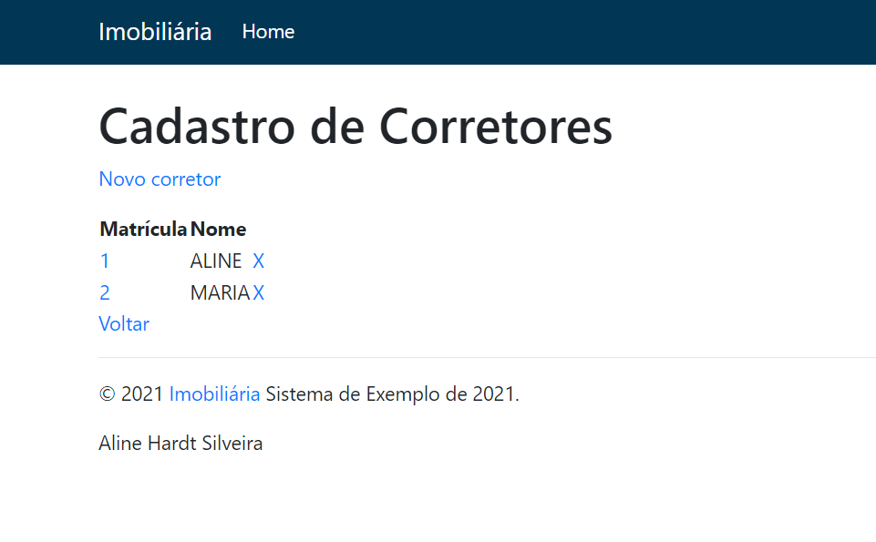
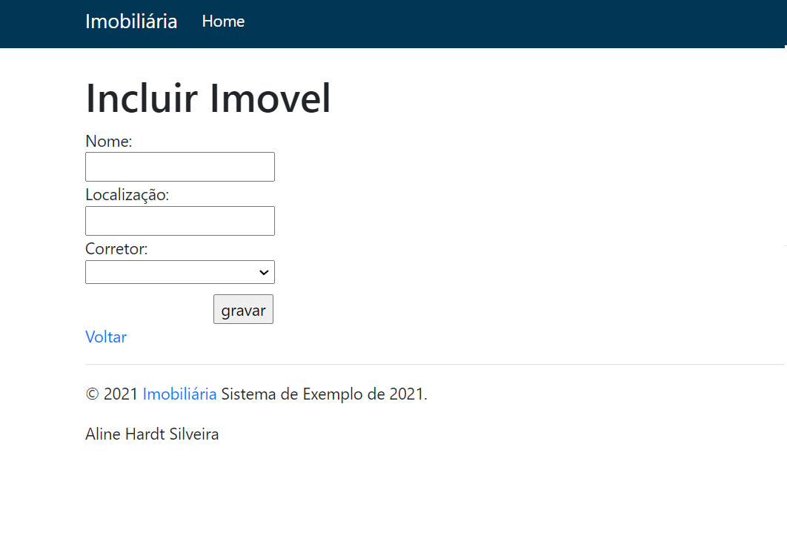
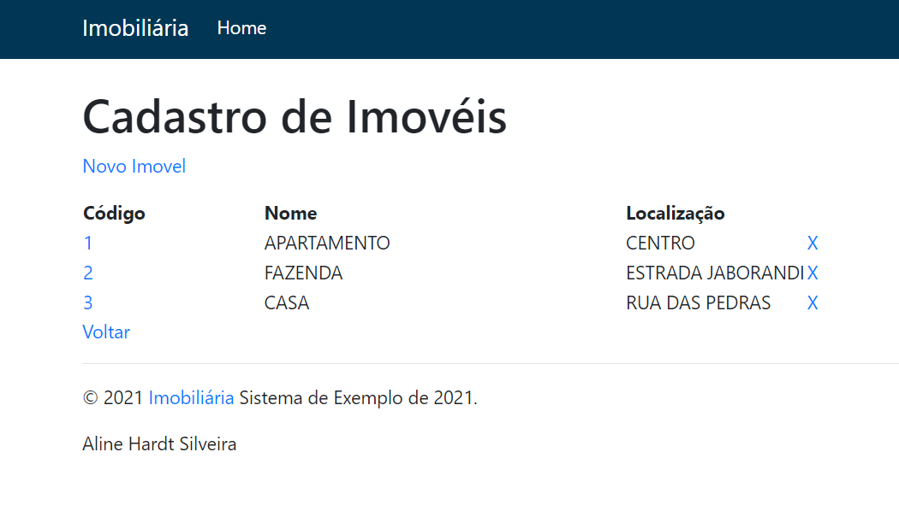

# Projeto - Laminas MVC - UniAlfa Umuarama - 2021

## Como Executar?

* Após clonar o projeto execute o comando abaixo, para baixar imagens e subir o container no Docker

```bash
$ docker-compose up -d --build
```

* Em seguida execute o comando para instalar as dependências do projeto.

```bash
$ docker-compose run laminas composer install
```

* E por fim habilite o modo de desenvolvimento

```bash
$ composer development-enable  # enable development mode
```

**Pronto agora é só abrir o http://localhost:8081.**

## Banco MySQL e gerenciador Adminer

Utilizar o arquivo sql dump.sql como exemplo, disponivel na pasta /data.

## Demonstração do Projeto

* Tela de Acesso e Inicial





* Tela Cadastro e listagem, pode ser feita a alteração ao clicar na matricula e exclusão no X.





* Tela Cadastro e listagem, pode ser feita a alteração ao clicar no codigo e exclusão no X.





## Framework Utilizado

- [laminas](https://docs.laminas.dev/mvc/)


